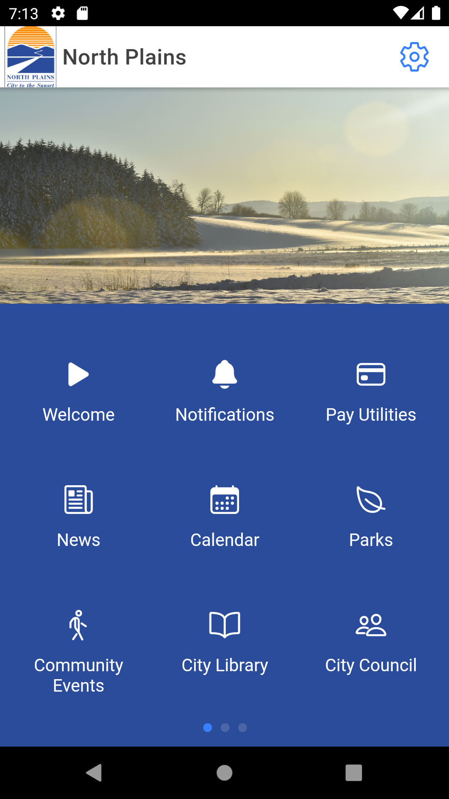
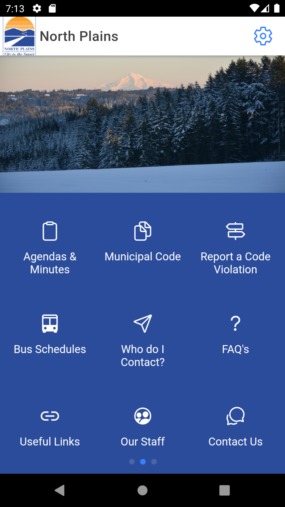
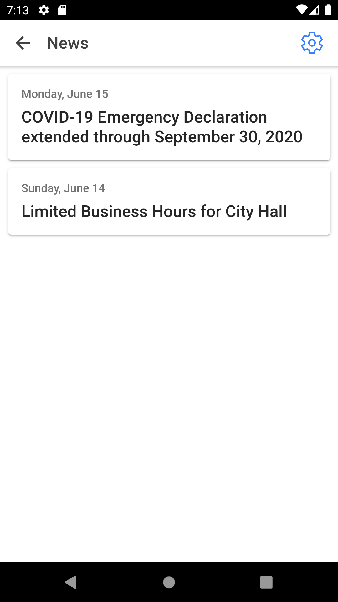
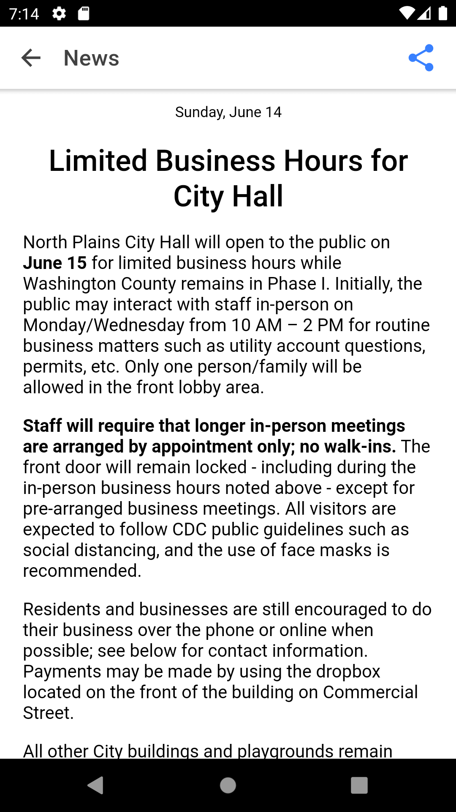
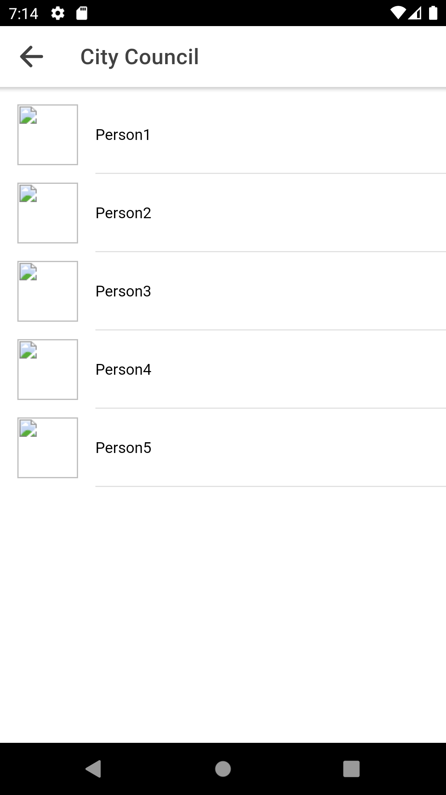
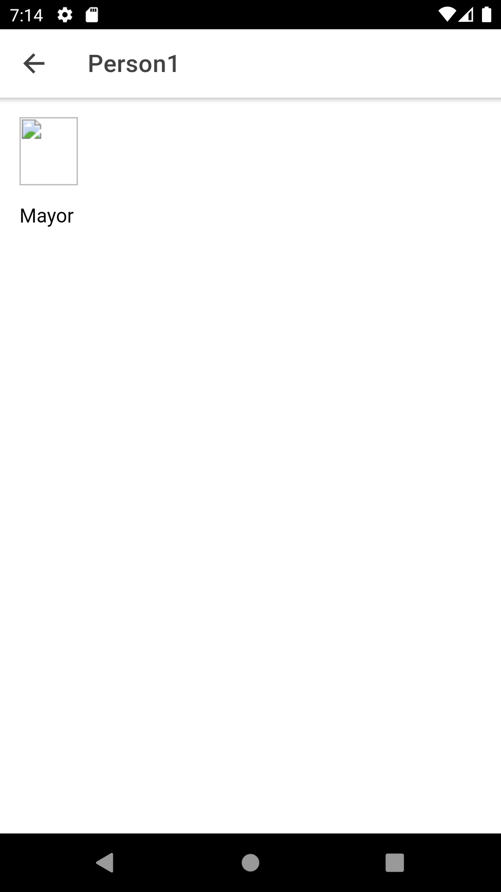
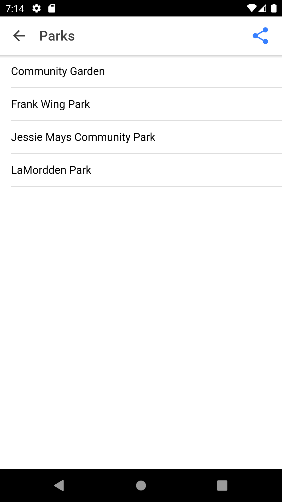
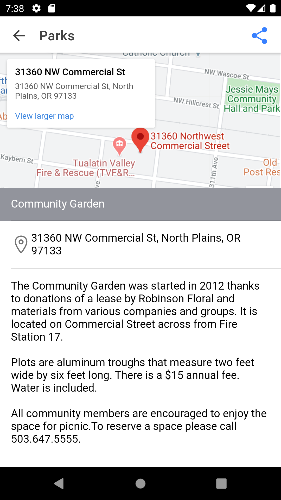
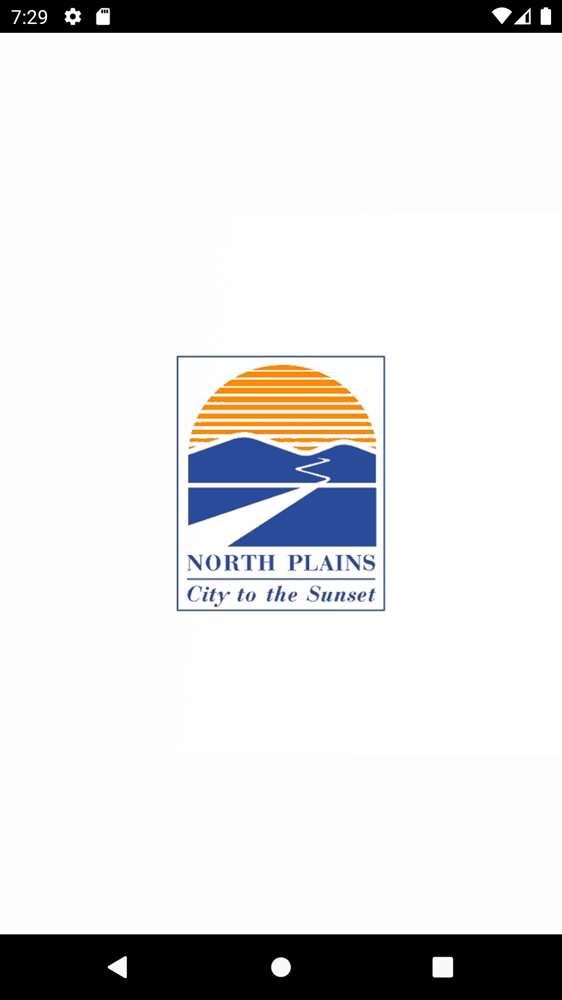
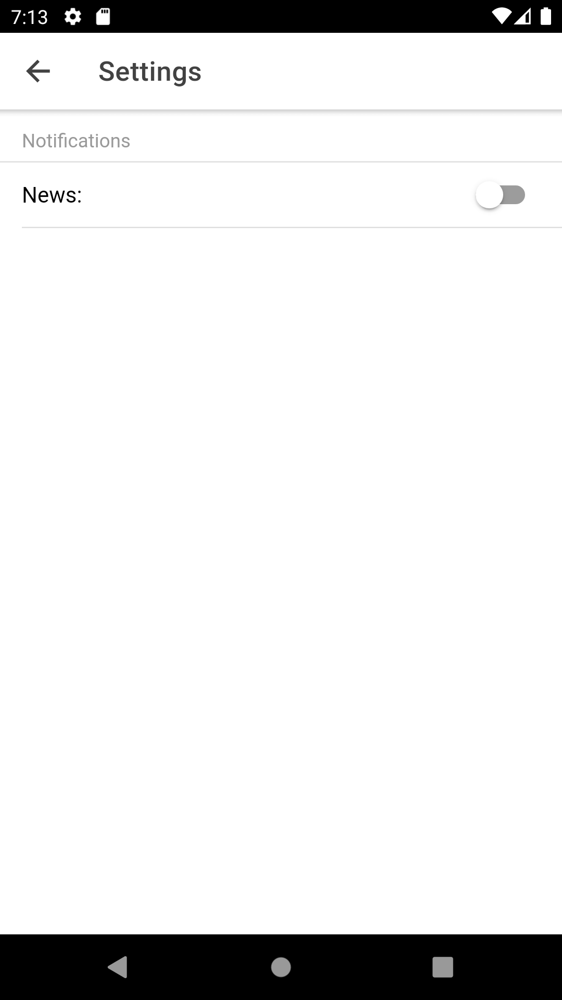

# North Plains App

Open source Android and iOS app to mirror the City of North Plains website. We hope to use project as a template for any city that wants their own app.

## Working Prototype

### Home page and overflow icons




### Click on "News" to access list of articles and corresponding details.




### Click on "City Council" to access members.




### "Parks" gives you a list of parks and corresponding details.




### Customizable splash page and settings which are accessible from most pages.




<style type='text/css'>
   img { width: 300px; }
</style>

## Framework, Runtime, CLI, and Package Versions

```
$ ionic info

Ionic:

   Ionic CLI       : 6.10.1
   Ionic Framework : @ionic/react 5.2.2

Capacitor:

   Capacitor CLI   : 2.2.0
   @capacitor/core : 2.2.0

Utility:

   cordova-res (update available: 0.15.1) : 0.15.0
   native-run                             : 1.0.0

System:

   NodeJS : v12.18.1
   npm    : 6.14.5
```
